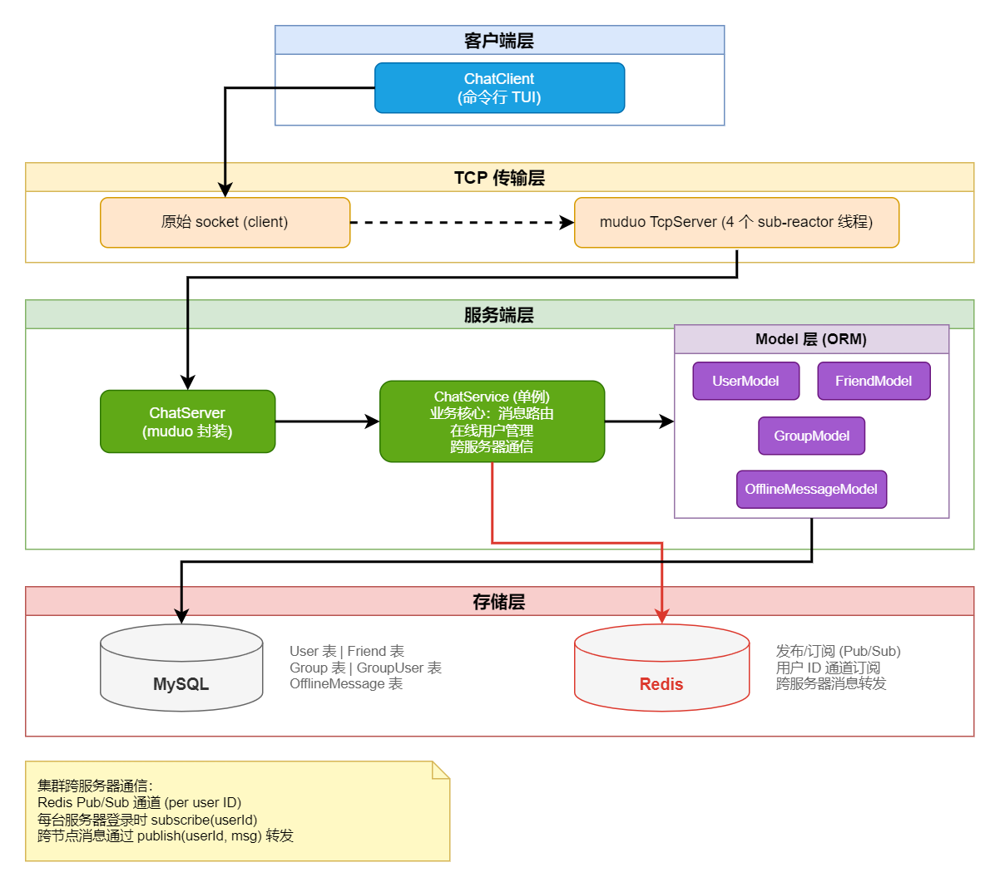
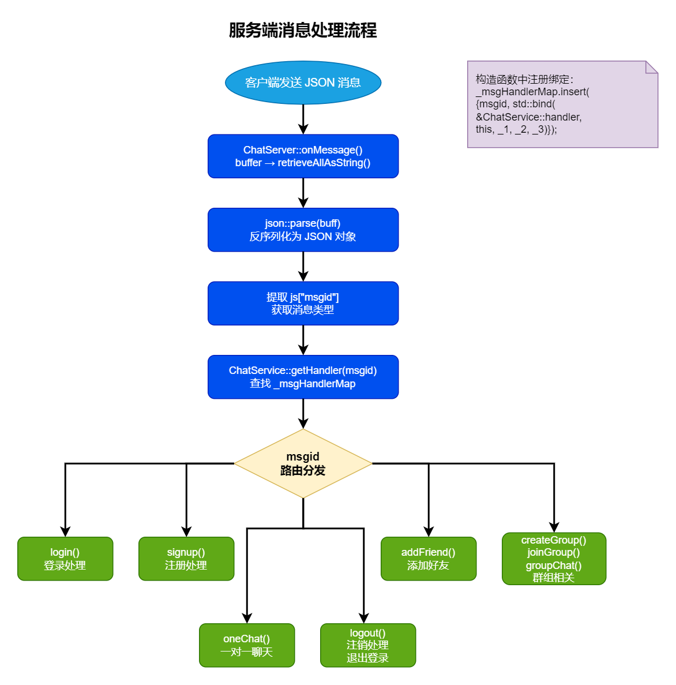
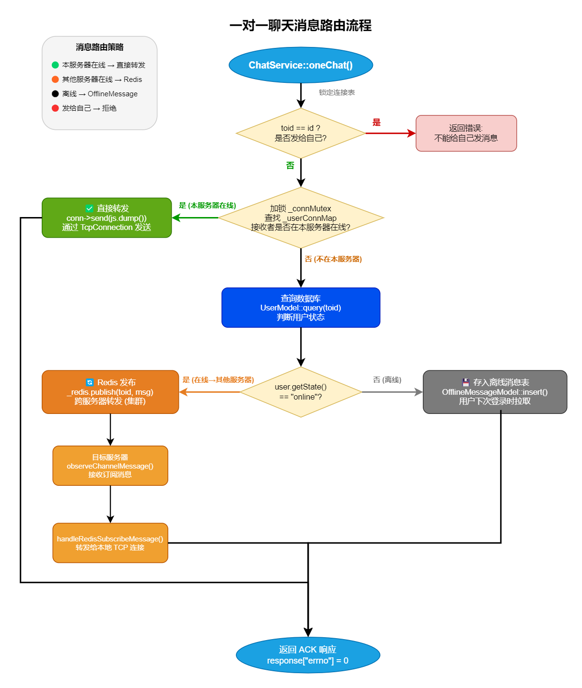
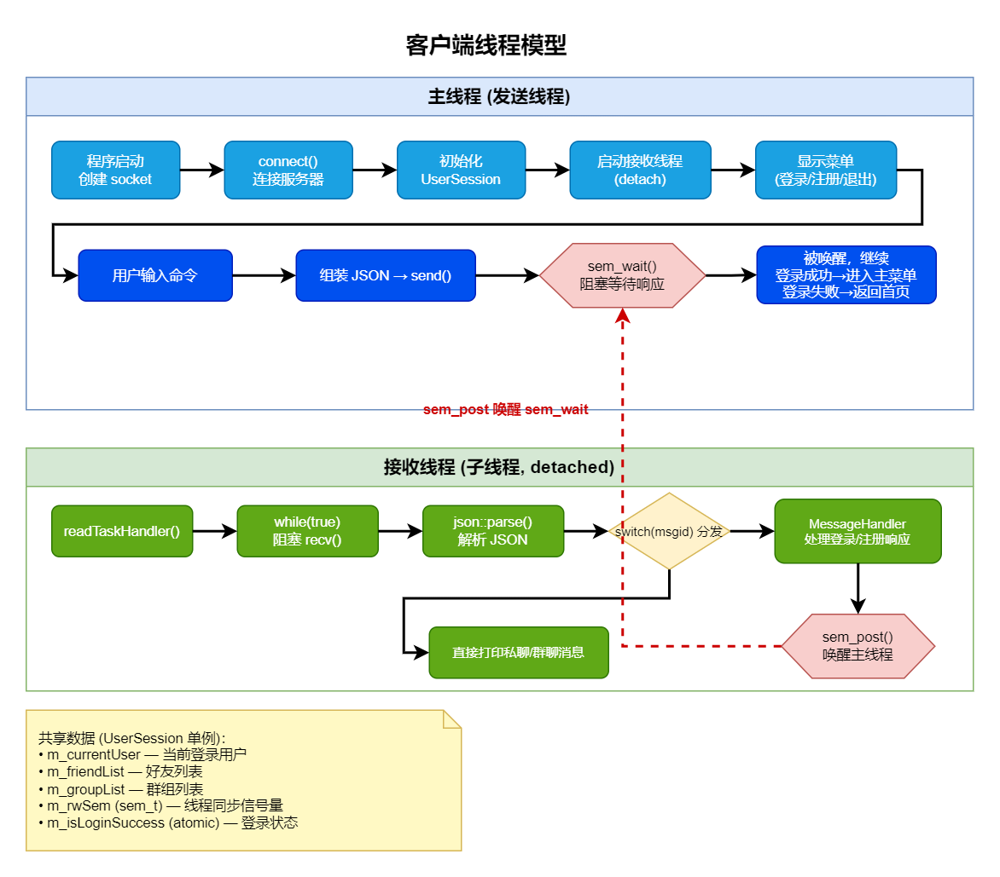

# ClusterChatServer

基于 muduo + Nginx + Redis + MySQL 的高并发集群聊天服务器，支持多节点水平扩展和跨服务器实时消息转发。

---

## 功能特性

- 👤 **用户系统** — 注册、登录、注销，登录后自动拉取离线消息和历史好友/群组数据
- 💬 **一对一聊天** — 实时私聊，消息通过三级智能路由投递
- 👥 **好友管理** — 添加好友，好友列表持久化存储
- 📢 **群组功能** — 创建群组、加入群组、群内广播聊天
- 🌐 **集群部署** — 多服务器节点通过 Redis Pub/Sub 互通，支持水平扩展
- 📡 **离线消息** — 用户离线时消息持久化到 MySQL，上线后自动拉取
- ⚡ **高并发** — muduo Reactor 模型（4 个 sub-reactor 线程）+ MySQL 连接池
- 🔐 **优雅关闭** — 捕获 SIGINT 信号，服务器退出前自动重置所有在线用户状态

## 技术栈

| 层级 | 技术 | 说明 |
|------|------|------|
| 网络库 | [muduo](https://github.com/chenshuo/muduo) | Reactor 多线程模型，1 main + 4 sub-reactor |
| 序列化 | [nlohmann/json](https://github.com/nlohmann/json) | 单头文件，所有消息体均为 JSON |
| 数据库 | MySQL (libmysqlclient) | 用户/好友/群组/离线消息持久化 |
| 连接池 | 单例 + 生产者-消费者 + shared_ptr RAII  | 条件变量通信、空闲连接定时回收、原子变量计数 |
| 缓存/消息队列 | Redis (hiredis) | Pub/Sub 实现集群跨服务器消息转发 |
| 客户端 | 原始 socket + POSIX 信号量 | 双线程模型，`sem_t` 同步请求-响应 |
| 构建 | CMake 3.0+ | Debug 模式开启 `DEBUGS` 宏 |
| 代码风格 | clang-format (LLVM) | 4 空格缩进，函数/类后大括号换行 |

## 架构概览



## 目录结构

```
ClusterChatServer/
├── autobuild.sh                   # 一键构建脚本
├── CMakeLists.txt                 # 根 CMake 配置
├── config/
│   └── database.cnf               # 数据库连接池配置（支持环境变量）
├── include/
│   ├── public.hpp                 # 共享协议：EnMsgType 枚举
│   ├── client/                    # 客户端头文件 (session, receiverThread, messageHandler)
│   └── server/
│       ├── chatserver.hpp         # muduo TcpServer 封装
│       ├── chatservice.hpp        # 业务核心单例
│       ├── database/              # MySQL 连接 RAII (Connection.hpp) + 连接池 (CommonConnectionPool.hpp)
│       ├── model/                 # ORM 层：User / Friend / Group / OfflineMessage 实体与数据访问
│       └── redis/                 # Redis Pub/Sub 封装
├── src/
│   ├── client/                    # 客户端源码 (main: TUI, session, receiverThread, messageHandler)
│   └── server/
│       ├── main.cpp               # 服务端入口 + SIGINT 优雅关闭
│       ├── chatserver.cpp         # muduo 事件回调 (onConnection / onMessage)
│       ├── chatservice.cpp        # 核心业务：消息路由、在线管理、跨服务器通信
│       ├── database/              # Connection.cpp + CommonConnectionPool.cpp
│       ├── model/                 # User / Friend / Group / OfflineMessage 数据访问实现
│       └── redis/                 # hiredis 封装 + 独立订阅线程
├── thirdparty/
│   └── json.hpp                   # nlohmann/json 单头文件
├── bin/                           # 编译产物 (gitignore)
├── build/                         # CMake 构建目录 (gitignore)
└── diagrams/                      # 架构图 (PNG)
```

## 快速开始

### 前置依赖

| 依赖 | 安装方式 |
|------|---------|
| g++ (C++11+) | `sudo apt install g++` |
| CMake 3.0+ | `sudo apt install cmake` |
| muduo | [源码编译安装](https://github.com/chenshuo/muduo) |
| MySQL Server | `sudo apt install mysql-server libmysqlclient-dev` |
| Redis Server | `sudo apt install redis-server` |
| hiredis | `sudo apt install libhiredis-dev` |

### 构建

```bash
# 一键构建
./autobuild.sh

# 或手动构建
cd build && cmake .. && make
```

编译产物在 `bin/` 目录下。

### 配置

数据库连接池通过 `config/database.cnf` 配置文件管理，支持环境变量替换（`$VAR` 或 `${VAR}`）：

```ini
[database]
ip=localhost
port=3306
username=root
password=${DB_PASSWORD}   # 支持环境变量
dbname=chat

[pool]
init_size=10              # 初始连接数
max_size=1024             # 最大连接数
max_idle_time=60          # 最大空闲时间 (秒)
connection_timeout=100    # 连接超时 (毫秒)
```

Redis 连接参数在 `src/server/redis/redis.cpp` 中配置（默认 `127.0.0.1:6379`）。

### 启动

```bash
# 启动服务端（指定 IP 和端口）
./bin/ChatServer 127.0.0.1 6000

# 启动客户端（默认连接 127.0.0.1:8000）
./bin/ChatClient
```

### 客户端命令

| 命令 | 格式 | 说明 |
|------|------|------|
| help | `help` | 显示命令帮助 |
| chat | `chat:目标用户ID:消息内容` | 发送私聊消息 |
| addfriend | `addfriend:目标用户ID` | 添加好友 |
| creategroup | `creategroup:群名:群描述` | 创建群组 |
| joingroup | `joingroup:群ID` | 加入群组 |
| groupchat | `groupchat:群ID:消息内容` | 发送群聊消息 |
| logout | `logout` | 注销登录 |

## 通信协议

### 消息类型 (EnMsgType)

| 枚举值 | 常量 | 说明 |
|--------|------|------|
| 1 | `LOGIN_MSG` | 登录请求 |
| 2 | `LOGIN_MSG_ACK` | 登录响应 |
| 3 | `SIGNUP_MSG` | 注册请求 |
| 4 | `SIGNUP_MSG_ACK` | 注册响应 |
| 5 | `ONE_CHAT_MSG` | 一对一聊天请求 |
| 6 | `ONE_CHAT_MSG_ACK` | 一对一聊天响应 |
| 7 | `ADD_FRIEND_MSG` | 添加好友请求 |
| 8 | `ADD_FRIEND_MSG_ACK` | 添加好友响应 |
| 9 | `CREATE_GROUP_MSG` | 创建群组请求 |
| 10 | `CREATE_GROUP_MSG_ACK` | 创建群组响应 |
| 11 | `JOIN_GROUP_MSG` | 加入群组请求 |
| 12 | `JOIN_GROUP_MSG_ACK` | 加入群组响应 |
| 13 | `GROUP_CHAT_MSG` | 群聊请求 |
| 14 | `GROUP_CHAT_MSG_ACK` | 群聊响应 |
| 15 | `LOGOUT_MSG` | 注销请求 |
| 16 | `LOGOUT_MSG_ACK` | 注销响应 |

### 数据包格式

所有消息采用变长数据包格式传输：

```
┌────────────────────┬──────────────────────────┐
│  4 字节 (大端序)    │  变长数据体               │
│  数据长度 (int32)   │  JSON 字符串              │
└────────────────────┴──────────────────────────┘
```

每条 JSON 消息必须包含 `"msgid"` 字段，服务端根据该字段路由到对应的处理函数。



## 集群通信机制

消息路由采用 **三级智能分发** 策略：



- 服务器启动时不会自动订阅通道 — 每个用户在**登录时**触发 `subscribe(userId)`
- Redis 订阅在**独立线程**中阻塞运行，通过回调函数上报服务层处理

## 线程模型

### 服务端

- **1 个 main reactor 线程** — 处理新连接 (`onConnection`)
- **4 个 sub-reactor 线程** — 处理已建立连接的读写事件 (`onMessage`)
- **1 个 Redis 订阅线程** — 阻塞接收 Pub/Sub 消息
- **连接池后台线程** — 生产新连接 + 定时回收空闲连接

### 客户端



- 私聊/群聊消息由接收线程**直接打印**到终端（无需唤醒主线程）
- 登录/注册响应通过 `MessageHandler` 处理后再 `sem_post` 唤醒主线程
- 共享数据通过 `UserSession` 单例访问

## 数据库表结构

| 表名 | 对应 Model | 说明 |
|------|-----------|------|
| `User` | UserModel | 用户信息 (id, name, password, state) |
| `Friend` | FriendModel | 好友关系 (userid, friendid) |
| `Group` | GroupModel | 群组信息 (id, name, desc) |
| `GroupUser` | GroupModel | 群成员关系 (groupid, userid, role) |
| `OfflineMessage` | OfflineMessageModel | 离线消息 (userid, message) |


